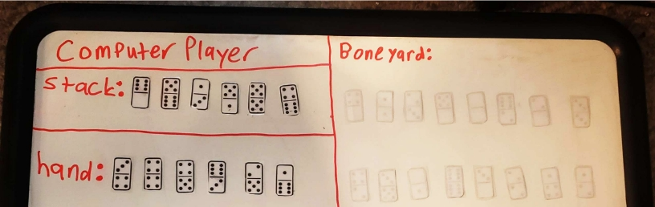
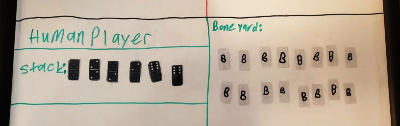
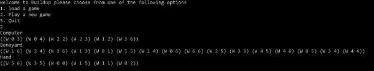
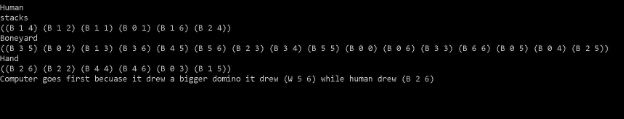
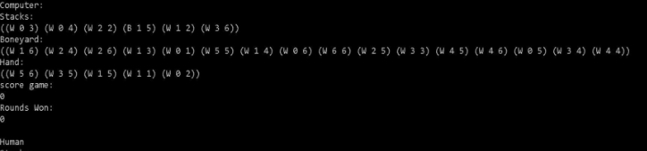
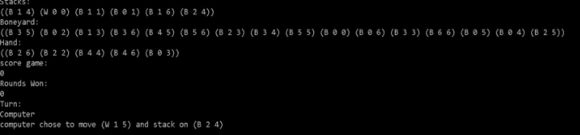
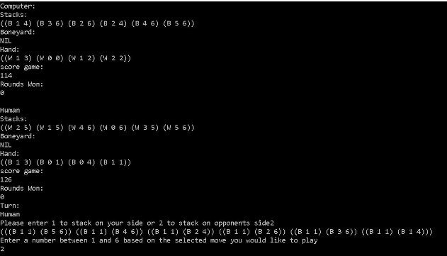
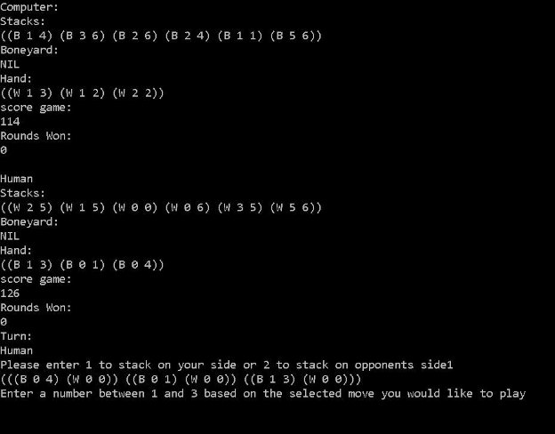
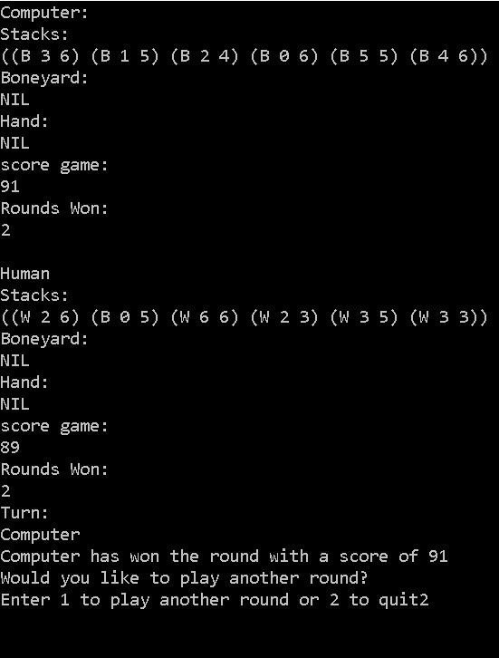
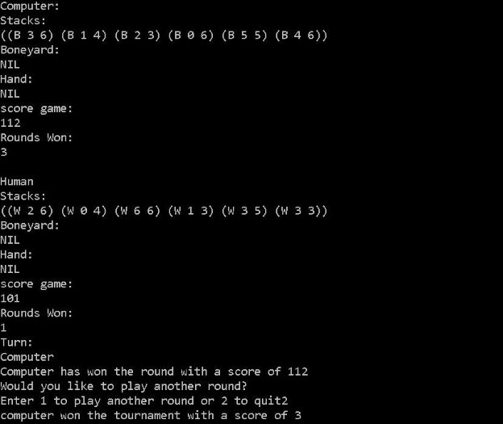

# Buildup (LISP) Collin Edition™ 

Real Life picture of Buildup Domino Game 

Note: it’s one of the few domino games that uses 2 different colored set of dominoes. 

## Bug Report 

The only bug detected occurs when the domino location is listed in help mode. Sometimes this may be incorrect. 

## Program execution 

This program was made using the Microsoft VSCode. The main executor is Collin.lsp file. To run this game you must install Clisp in Ubuntu - you do this by typing  sudo apt install Clisp. 

From there, type clear && clisp Collin.lsp and the program should run. 

## Feature List 

- ### Missing Features 

 Help mode  

 Human menu 

 Computer player strategy (it plays randomly) 

- ### Extra features  

 When possible, it will display all possible moves for a desired stack play 

## Data Structures Used 

- A list was used for all pieces for individual tiles, stacks, boneyards, hands, individual players, and the game. 

## Log 

1. 2/10/2023 After spending a few hours wrapping my head around how Lisp works, I made the project and got the basic welcome menu with the proper input validation working. This helped in introducing myself to the lisp syntax. 
1. 2/11/2023 and 2/12/2023 I figured out basic list setup and was able to create the basic functions like new\_round and the boneyard models.  
1. 2/13/2023 to 2/17/2023 I figured out shuffling, displaying updated lists, and parsing into one gigantic game list so that I only had to display one gigantic list. 
4. 2/18/2023 I created a function to determine the value for a tile eg B23 = black 5 domino as well as who the first player is.  
4. 2/19/2023 and 2/20/2023 I got legal placement and all moves to be determined based on a human or ai selection. 
4. 2/21/2023 to 2/25/2023 I got the hang of Lisp at this point and now both human and computer have actual moves and scoring working. I did run into some crashes in Lisp, aka “stack overflow.”  
4. 2/26/2023 to 2/28/2023 I fixed crashes utilizing checker functions and playing automatically to prevent crashing. 
4. 3/1/2023 I got a hand to play recursively since there are 4 hands in a round. 
4. 3/2/2023 I optimized and ironed out any possible glitches that were left over. 
10. 3/3/2023 I added in serialization, AKA, loading in a game, along with having the computer display the move it made.  
10. 3/4/2023 to 3/5/2023 I added in the last- minute patches and tested extensively. 
10. 3/6/2023 to 3/7/2023 I documented work and cleaned up.  

## Screen shots 

1. Main Menu

2. Round information so far

3. Computer player method (is random but always legal)

4. Human input for stacking opponent’s stack 

5. Human input for stacking on its own stack 

6. Load game prompt 

7. Which player won 

8. Which player won the tournament 

