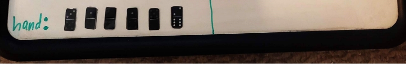

# Buildup (LISP) Collin Edition™ 

Real Life picture of Buildup Domino Game 

Note: it’s one of the few domino games that uses 2 different colored set of dominoes. 
## Build Up Domino (RULES OF THE GAME)
Build Up is a two-player dominoes game, designed by David Vander Ark.
### The Objective
The objective of this game is to score the highest after the final hand in a round.
### The Players
Two players play this game - one player will be the human user of the program, and the other player will be the program/computer. The two players will play a "tournament", consisting of one or more rounds. Each round will consist of the two players playing four hands, each hand consisting of 4-6 tiles.
### The Setup
The game uses two double-six sets. A double-six set contains 28 tiles. Each tile has two ends, each end containing 0-6 pips. The double-six set contains tiles with the following combination of pips:

0-0, 0-1, 0-2, 0-3, 0-4, 0-5, 0-6, 

1-1, 1-2, 1-3, 1-4, 1-5, 1-6,

2-2, 2-3, 2-4, 2-5, 2-6,

3-3, 3-4, 3-5, 3-6,

4-4, 4-5, 4-6,

5-5, 5-6,

6-6.
#### Two such sets are used in the game - a white set used by the computer and a black set used by the human player. The two sets are shuffled before use.
Each player draws six tiles from the player's shuffled set and places them face up to constitute two rows of six tiles. The remaining tiles in each shuffled set form the boneyard for the respective player (black for human and white for computer).
### A Round
Each round consists of four hands. Six tiles each are used in the first three hands. The remaining 4 tiles are used in the last hand. For the first hand, in addition to the tile used to determine the first player, players draw five additional tiles from their boneyards. For subsequent hands, players draw the required number of tiles from the shuffled boneyard.
### First Player
Each player draws a tile from his/her boneyard. The player whose tile has the most pips plays first. If both the players have the same number of pips, the tiles are returned to the boneyards, the boneyards are shuffled and the process is repeated.
### A Hand
In each hand, the two players alternate placing one tile each, starting with the first player as determined above. The hand ends when both the players have placed all their tiles, or when neither player can place a tile. If one player cannot place a tile on his/her turn, the player will pass, allowing the other player to continue.
### Placement of a tile
A player places a tile from her/his hand on top of one of the twelve tile stacks started during setup, subject to the following rules:
- A non-double tile may be placed on any tile as long as the total number of pips on it is greater than or equal to that of the tile on which it is placed.
- A double tile (e.g., 0-0, 1-1, 2-2) may be placed on any non-double tile, even if the non-double tile has more pips.
- A double tile may be placed on another double tile only if it has more total pips than the tile on which it is placed.
### Score
When a hand ends, each player is awarded points as follows:
The points equal the total pips on all the tiles of the player's color that are on top of the twelve stacks.
If the player has any tiles that could not be placed, the total pips of these tiles is subtracted from the points. The tiles themselves are discarded, not returned to the boneyeard.
These points are added to the current score of the player. After the scores are updated, the next hand is started.
When the final hand ends, the player with the highest score wins the round. Ifboth the players have the same number of points, the round is a draw.
### The Tournament
After each round, the human player is asked whether she/he wants to play another round.
If yes, another round is played as described above and the process is repeated.
If no, the winner of the tournament is announced and the game quits. The winner of the tournament is the player who has won the most number of rounds. If both the players have won the same number of rounds, the tournament is a draw.
Ideally, players should try to place on top of their opponent's tiles rather than their own, so that more of their tiles will end up on top of stacks. But a player may choose to place on top of his/her own tile in order to play a tile that can otherwise not be played. Another way to play a tile that can otherwise not be played is to first place a low-valued double-tile on top of a high-valued tile.

## Bug Report 

The only bug detected occurs when the domino location is listed in help mode. Sometimes this may be incorrect. 

## Program execution 

This program was made using the Microsoft VSCode. The main executor is Collin.lsp file. To run this game you must install Clisp in Ubuntu - you do this by typing  sudo apt install Clisp. 

From there, type clear && clisp Collin.lsp and the program should run. 

## Feature List 

- ### Missing Features 

 Help mode  

 Human menu 

 Computer player strategy (it plays randomly) 

- ### Extra features  

 When possible, it will display all possible moves for a desired stack play 

## Data Structures Used 

- A list was used for all pieces for individual tiles, stacks, boneyards, hands, individual players, and the game. 

## Log 

1. 2/10/2023 After spending a few hours wrapping my head around how Lisp works, I made the project and got the basic welcome menu with the proper input validation working. This helped in introducing myself to the lisp syntax. 
1. 2/11/2023 and 2/12/2023 I figured out basic list setup and was able to create the basic functions like new\_round and the boneyard models.  
1. 2/13/2023 to 2/17/2023 I figured out shuffling, displaying updated lists, and parsing into one gigantic game list so that I only had to display one gigantic list. 
4. 2/18/2023 I created a function to determine the value for a tile eg B23 = black 5 domino as well as who the first player is.  
4. 2/19/2023 and 2/20/2023 I got legal placement and all moves to be determined based on a human or ai selection. 
4. 2/21/2023 to 2/25/2023 I got the hang of Lisp at this point and now both human and computer have actual moves and scoring working. I did run into some crashes in Lisp, aka “stack overflow.”  
4. 2/26/2023 to 2/28/2023 I fixed crashes utilizing checker functions and playing automatically to prevent crashing. 
4. 3/1/2023 I got a hand to play recursively since there are 4 hands in a round. 
4. 3/2/2023 I optimized and ironed out any possible glitches that were left over. 
10. 3/3/2023 I added in serialization, AKA, loading in a game, along with having the computer display the move it made.  
10. 3/4/2023 to 3/5/2023 I added in the last- minute patches and tested extensively. 
10. 3/6/2023 to 3/7/2023 I documented work and cleaned up.  

## Screen shots 

1. Main Menu

2. Round information so far

3. Computer player method (is random but always legal)

4. Human input for stacking opponent’s stack 

5. Human input for stacking on its own stack 

6. Load game prompt 

7. Which player won 

8. Which player won the tournament 

